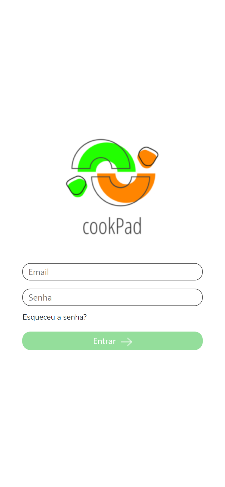
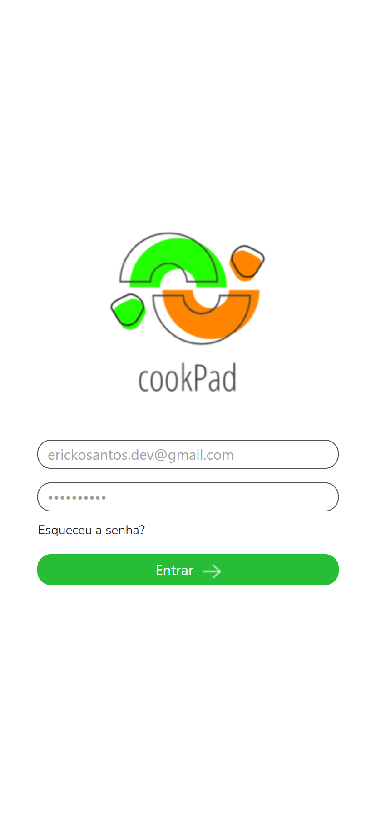
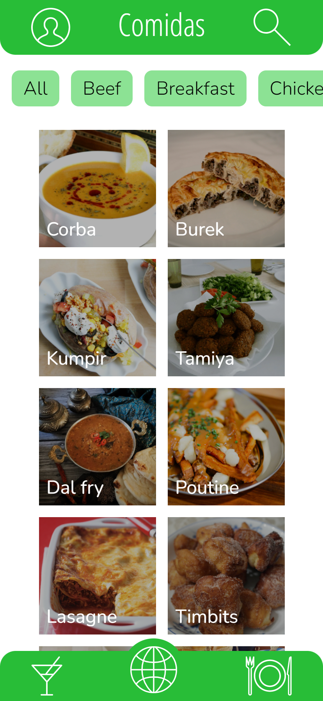
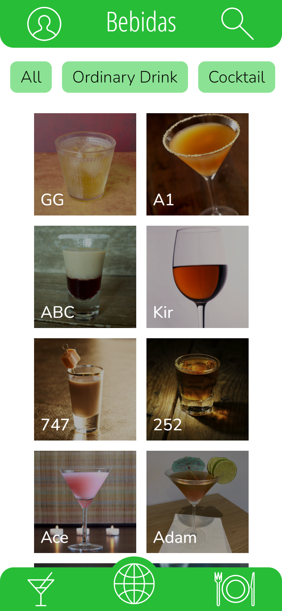
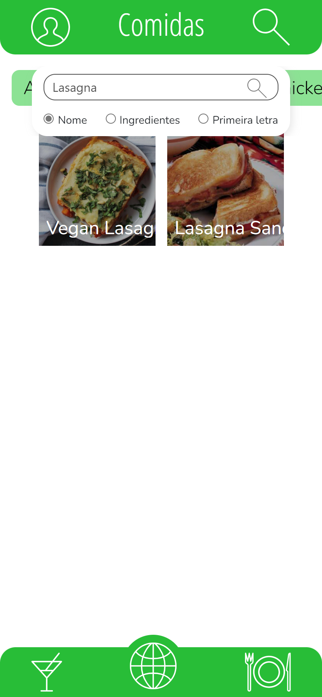

## Recipes App made with React

This was a group project developed in the [Software Development Course at Trybe](https://www.betrybe.com/formacao-desenvolvimento-web). In this project we were able to catch recipes of foods and drinks from the [TheMealDB](https://www.themealdb.com/) and [TheCocktailDB](https://www.thecocktaildb.com/) and used React to show our Recipes and the users should be able to start a recipe, mark as favorite and finish it. 
This project had the contribution of:
- [Erick Santos (me)](https://www.linkedin.com/in/erickosantos/)
- [Gabriel Lenz](https://www.linkedin.com/in/lenzgabriel/)
- [Yuri Garrido](https://www.linkedin.com/in/yurigarrido/)
- [Marlon Lacerda](https://github.com/marlondlacerda)

### How to download and run the project code

First of all you need to download the project files, you can do this using git.

```bash
git clone git@github.com:erick-ol/react-recipes-app.git
```

After you clone the repository you need to enter the folder that contains the project you just downloaded and install all the dependencies of this application.

```bash
npm install
```

Then you just need to start your application to have fun and learn a lot more.

```bash
npm start
```

### Images from the project






